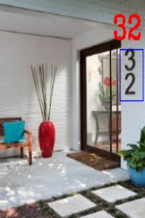
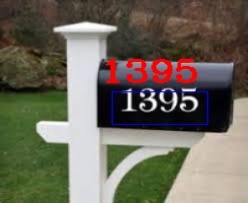
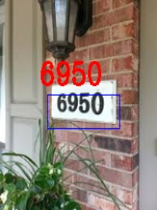
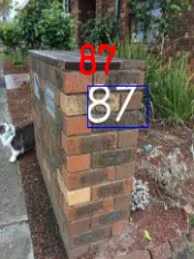
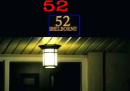

# Image Digit Sequence Recognizer Using Convolutional Neural Networks

<figure>
 

   

   

   

   

  
  </figure>
  
To design the digit detection and recognition system, the famous [SVHN dataset](http://ufldl.stanford.edu/housenumbers/) was
utilized, which is a real-world dataset obtained from Google Street View images and used by many
for developing digit recognition algorithms. 

The digit sequence classification and detection was achieved by training two VGG16 convolutional neural
networks using transfer learning.

Detection pipeline uses MSER for image segmentation, followed by detection and classification by the two CNNs. An image pyramid approach with sliding window was also used here. More details can be found [here](https://github.com/shaan0056/Image-Digit-Sequence-Recognizer-using-CNN-/blob/master/Final%20Project%20Report.pdf).
